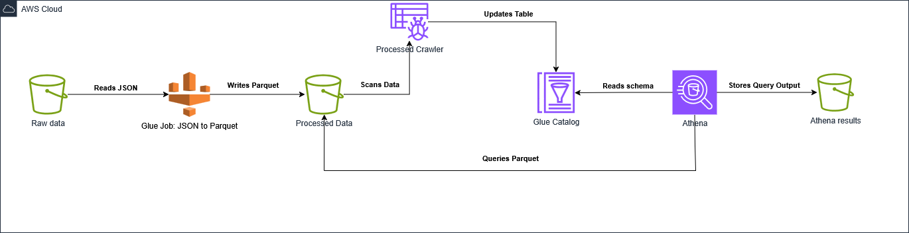
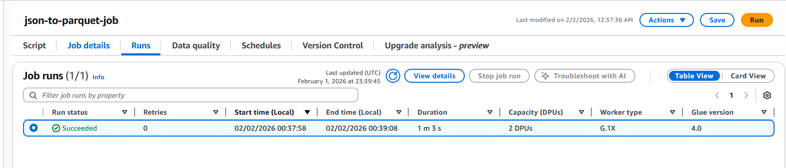
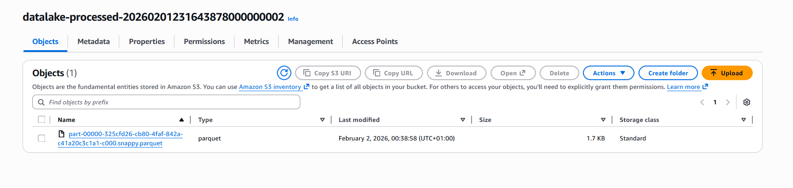

# AWS Secure Serverless Data Lake (Terraform)

##  Project Overview
This project deploys a secure, serverless Data Lake on AWS using **Terraform**. It ingests raw logs, secures them with **IAM & Encryption**, processes them using **AWS Glue (ETL)**, and makes them queryable via **Amazon Athena**.

The goal is to build a scalable data pipeline that adheres to the **Principle of Least Privilege** and separates storage (S3) from compute (Glue/Athena).

##  Architecture



**Data Flow:**
1.  **Ingest:** Raw JSON logs are uploaded to the `Raw Data Zone` (S3).
2.  **Secure:** Buckets are encrypted (SSE-S3) and public access is strictly blocked.
3.  **Catalog:** AWS Glue Crawler scans the raw data to infer schema.
4.  **Process (ETL):** An AWS Glue Job converts JSON data to optimized **Parquet** format.
5.  **Analyze:** Amazon Athena is used to query both raw and processed data using Standard SQL.

##  Tech Stack
* **Infrastructure as Code:** Terraform
* **Cloud Provider:** AWS
* **Storage:** Amazon S3 (Raw & Processed Zones)
* **ETL & Compute:** AWS Glue (Crawlers & Jobs)
* **Analytics:** Amazon Athena
* **Security:** AWS IAM (Custom Roles & Policies), S3 Encryption (SSE)

##  Security Features
* **Least Privilege:** Custom IAM policies ensure Glue only accesses specific buckets.
* **Encryption at Rest:** All S3 buckets utilize Server-Side Encryption (AES-256).
* **Public Access Block:** S3 buckets are explicitly blocked from public access at the Terraform resource level.
* **Isolation:** Separate buckets for Raw and Processed data to prevent accidental data corruption.


##  How to Deploy

### Prerequisites
* AWS CLI installed and configured
* Terraform installed (v1.0+)

### Steps
1.  **Clone the Repo**
    ```bash
    git clone https://github.com/Amine-Jebari/secure-datalake-terraform.git
    cd secure-datalake-terraform
    ```

2.  **Initialize Terraform**
    ```bash
    terraform init
    ```

3.  **Deploy Infrastructure**
    ```bash
    terraform apply --auto-approve
    ```

4.  **Upload Data & Run ETL**
    * Upload `sample_data.json` to the Raw Bucket.
    * Run the Glue Job `json-to-parquet-job` from the AWS Console.

5.  **Query Data**
    * Open Athena and query the `security_logs_db` database.

###  Project Screenshots

### 1. Analytics in Action (Amazon Athena)
*Querying the processed Parquet data to identify failed login attempts without scanning the entire dataset.*


### 2. ETL Pipeline Success (AWS Glue)
*The serverless Spark job successfully converted raw JSON logs into optimized Parquet format.*


### 3. Data Storage (Amazon S3)
*Verified Parquet files stored in the "Processed" zone, encrypted at rest.*


##  Cleanup
destroy the infrastructure:
```bash
terraform destroy